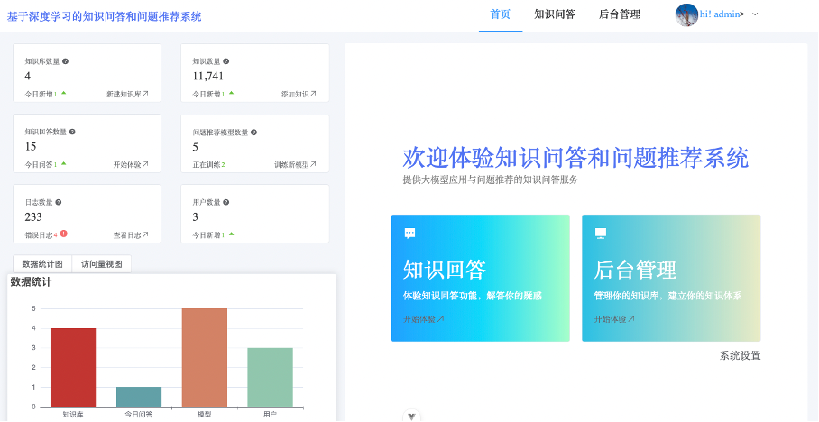

# 基于大语言模型多知识问答系统
## 介绍
本项目是基于大语言模型开发的知识问答系统，结合RAG技术，利用Elasticsearch搭建知识库。同时使用Embedding、K均值和余弦相似度算法，实现了相关问题推荐的功能。

frontend为前端代码分支，backend为后端代码分支

前端使用Vue3和Elementplus实现，基于Node.js 21。

后端使用FastAPI实现，基于Python 3.10。

首页

知识问答界面

## 运行
### 前端

    pnpm install
    pnpm dev

### 后端
配置文件在config.yaml中

    pip install -r requirements.txt
    uvicorn APP:app --reload

